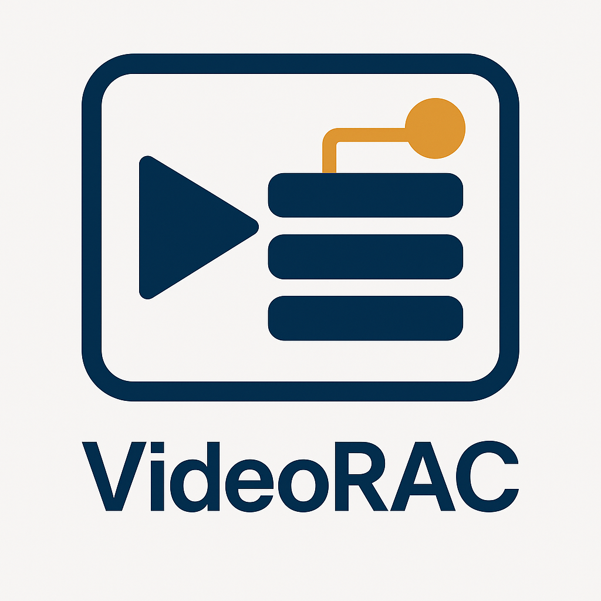

# VideoRAC: Retrieval-Adaptive Chunking for Lecture Video RAG (Official CSICC 2025 Implementation)

<div align="center">



**Official implementation of the CSICC 2025 paper**
**“Adaptive Chunking for VideoRAG Pipelines with a Newly Gathered Bilingual Educational Dataset”**
*(Presented at the 30th International Computer Society of Iran Computer Conference — CSICC 2025)*

[](https://ieeexplore.ieee.org/document/10967455)
[](https://huggingface.co/datasets/UIAIC/EduViQA)
[](https://www.python.org/downloads/)
[](LICENSE)

</div>

---

## 📖 Overview

**VideoRAC** (Video Retrieval-Adaptive Chunking) provides a complete framework for multimodal retrieval-augmented generation (RAG) in educational videos. This toolkit integrates **visual-semantic chunking**, **entropy-based keyframe selection**, and **LLM-driven question generation** to enable effective multimodal retrieval.

This repository is the **official implementation** of the paper:

> **Hemmat, A., Vadaei, K., Shirian, M., Heydari, M.H., Fatemi, A.**
> *“Adaptive Chunking for VideoRAG Pipelines with a Newly Gathered Bilingual Educational Dataset,”*
> Proceedings of the 30th International Computer Society of Iran Computer Conference (CSICC 2025), University of Isfahan, 2025.

---

## 🧩 Core Components

| Module                        | Class                  | Description                                                                                      |
| ----------------------------- | ---------------------- | ------------------------------------------------------------------------------------------------ |
| `processing.chunking.py`      | **`HybridChunker`**    | Detects slide transitions using CLIP embeddings and SSIM to segment videos into coherent chunks. |
| `processing.entropy_utils.py` | **`EntropyUtils`**     | Computes frame entropy for selecting representative keyframes.                                   |
| `processing.qa_generation.py` | **`VideoQAGenerator`** | Generates structured Q&A pairs using transcripts and visual frame descriptions.                  |

---

## 🧠 Research Background

This framework underpins the **EduViQA bilingual dataset**, designed for evaluating lecture-based RAG systems in both Persian and English. The dataset and code form a unified ecosystem for multimodal question generation and retrieval evaluation.

**Key Contributions (per paper):**

* 🎥 **Adaptive Hybrid Chunking:** Combines CLIP cosine similarity with SSIM-based visual comparison.
* 🧮 **Entropy-Based Keyframe Selection:** Extracts high-information frames for retrieval.
* 🗣️ **Transcript–Frame Alignment:** Synchronizes ASR transcripts with visual semantics.
* 🔍 **Multimodal Retrieval:** Integrates visual and textual embeddings for RAG.
* 🧠 **Benchmark Dataset:** 20 bilingual educational videos, 50 QA pairs each.

---

## ⚙️ Installation

```bash
# Clone repository
git clone https://github.com/your-org/VideoRAC.git
cd VideoRAC

# Create environment & install\python -m venv .venv
source .venv/bin/activate  # Windows: .venv\Scripts\activate
pip install -r requirements.txt
```

---

## 🚀 Usage Example

### 1️⃣ Hybrid Chunking

```python
from VideoRAC import HybridChunker

chunker = HybridChunker(alpha=0.6, threshold_embedding=0.85)
chunks, timestamps, duration = chunker.chunk("lecture.mp4")
chunker.evaluate()
```

### 2️⃣ Generate Q&A

```python
from VideoRAC import VideoQAGenerator

def my_llm_fn(messages):
    from openai import OpenAI
    client = OpenAI()
    response = client.chat.completions.create(model="gpt-4o", messages=messages)
    return response.choices[0].message.content

urls = ["https://www.youtube.com/watch?v=2uYu8nMR5O4"]
qa = VideoQAGenerator(video_urls=urls, llm_fn=my_llm_fn)
qa.process_videos()
```

---

## 📊 Results Summary (from CSICC 2025)

| Method                   | AR       | CR       | F        | Notes                        |
| ------------------------ | -------- | -------- | -------- | ---------------------------- |
| **VideoRAC (CLIP+SSIM)** | **0.87** | **0.82** | **0.91** | Best performance overall     |
| CLIP-only                | 0.80     | 0.75     | 0.83     | Weaker temporal segmentation |
| Simple Slicing           | 0.72     | 0.67     | 0.76     | Time-based only              |

> Evaluated using RAGAS metrics: *Answer Relevance (AR)*, *Context Relevance (CR)*, and *Faithfulness (F)*.

---

## 🧾 License (CC BY 4.0)

This repository and its dataset are licensed under the **Creative Commons Attribution 4.0 International License (CC BY 4.0)**.

You are free to share and adapt the work with attribution. When using VideoRAC or EduViQA in research, please cite the CSICC 2025 paper:

```bibtex
@inproceedings{hem2025videorac,
  title={Adaptive Chunking for VideoRAG Pipelines with a Newly Gathered Bilingual Educational Dataset},
  author={Hemmat, Arshia and Vadaei, Kianoosh and Shirian, Melika and Heydari, Mohammad Hassan and Fatemi, Afsaneh},
  booktitle={30th International Computer Society of Iran Computer Conference (CSICC 2025)},
  year={2025},
  organization={IEEE}
}
```

---

## 👥 Authors

**University of Isfahan, Department of Computer Engineering**

* **Arshia Hemmat** — [a.hemmat@eng.ui.ac.ir](mailto:a.hemmat@eng.ui.ac.ir)
* **Kianoosh Vadaei** — [k.vadaei@eng.ui.ac.ir](mailto:k.vadaei@eng.ui.ac.ir)
* **Melika Shirian** — [m.shirian@eng.ui.ac.ir](mailto:m.shirian@eng.ui.ac.ir)
* **Mohammad Hassan Heydari** — [mh.heydari@eng.ui.ac.ir](mailto:mh.heydari@eng.ui.ac.ir)
* **Afsaneh Fatemi** — [a.fatemi@eng.ui.ac.ir](mailto:a.fatemi@eng.ui.ac.ir)

---

<div align="center">

**⭐ Official CSICC 2025 Implementation — Give it a star if you use it in your research! ⭐**
*Made with ❤️ at University of Isfahan*

</div>
