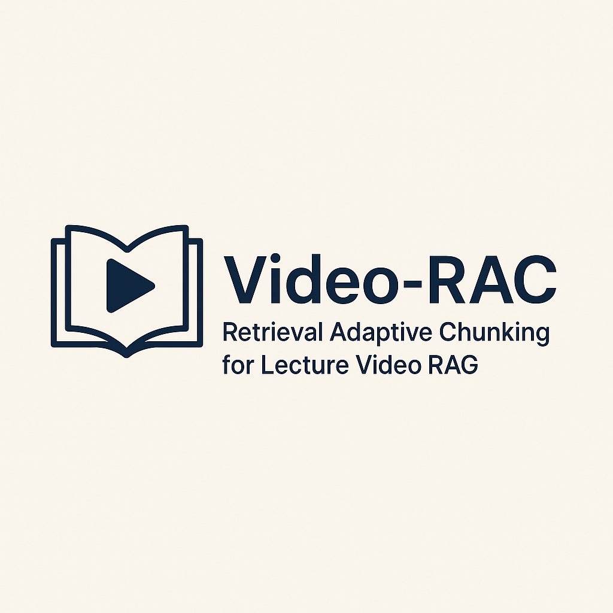
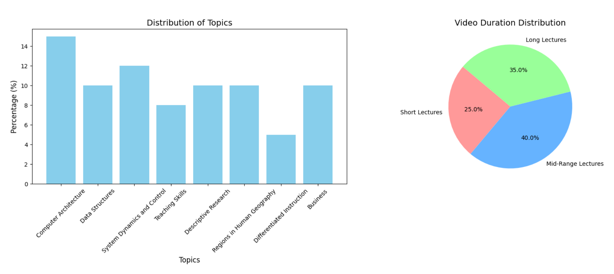

# Video-RAC: Retrieval Adaptive Chunking for Lecture Video RAG

<div align="center">



**An adaptive chunking methodology for lecture videos using CLIP embeddings and SSIM to construct multimodal chunks for enhanced RAG performance**

[](https://ieeexplore.ieee.org/document/10967455/)
[](https://huggingface.co/datasets/UIAIC/EduViQA)
[](https://www.python.org/downloads/)

</div>

---

## 📖 Overview

We present **Video-RAC**, an adaptive chunking methodology for lecture videos within Retrieval-Augmented Generation (RAG) pipelines. Using **CLIP embeddings** and **SSIM** to detect coherent slide transitions, plus **entropy-based keyframe selection**, we construct multimodal chunks that align audio transcripts and visual frames.

**Key Highlights:**
- ✨ **Adaptive chunking** using CLIP embeddings and SSIM for semantic segmentation
- 🌍 **Bilingual dataset** (Persian & English) with 20 educational videos
- 📊 **50 QA pairs per video** for comprehensive evaluation
- 🎯 **RAGAS evaluation** showing +12-15% improvement over baseline methods
- 🔥 **Multimodal (image+text)** retrieval achieves best performance

---

## 🎯 Key Contributions

### 1. **Adaptive Video Chunking**
Semantic segmentation using CLIP embeddings and SSIM to detect slide transitions and construct coherent chunks.

### 2. **Bilingual Educational Dataset**
Curated collection of Persian & English lectures with mid/long duration and 50 QA pairs per video. Available on [Hugging Face](https://huggingface.co/datasets/UIAIC/EduViQA).

### 3. **Low-Resource Friendly Pipeline**
Efficient multimodal integration using VLMs with FAISS-based retrieval and temporal mapping.

### 4. **RAGAS Evaluation**
Comprehensive evaluation using Answer Relevance, Context Relevance, and Faithfulness metrics.

---

## 📊 Dataset

### EduViQA: Bilingual Educational Video QA Dataset


*Dataset composition highlighting topic distribution and lecture duration proportions.*

### Dataset Statistics

| Metric | Value |
|--------|-------|
| **Total Videos** | 20 (10 Persian, 10 English) |
| **Professors** | 5 |
| **Duration Mix** | ~25% short, 40% mid, 35% long |
| **QA Pairs per Video** | 50 |
| **Format** | JSON |

### Topics Covered
- Computer Architecture
- Data Structures
- System Dynamics and Control
- Teaching Skills
- Descriptive Research
- Regions in Human Geography
- Differentiated Instruction
- Business

**📥 Access Dataset:** [Hugging Face - EduViQA](https://huggingface.co/datasets/UIAIC/EduViQA)

---

## 🔬 Method


*Pipeline demonstrating adaptive chunking with CLIP embeddings, frame selection, and audio-transcript alignment for optimal RAG integration.*

### Pipeline Stages

1. **Adaptive Chunking (CLIP + SSIM)**: Segment videos into semantically coherent chunks by detecting slide transitions using cosine similarity of CLIP embeddings combined with SSIM.

2. **Frame Selection by Entropy**: For each chunk, select three keyframes: maximum entropy frame, first frame, and last frame.

3. **Audio Transcript Chunking**: Recursively split audio transcripts into text chunks using semantic boundaries.

4. **Retrieval**: Use OpenAI's text-embedding-3-large for embeddings; FAISS for efficient cosine similarity search.

5. **Generation & Evaluation**: Evaluate using RAGAS metrics across text-only, image-only, and multimodal scenarios.

### Algorithms Compared

| Method | Cost | Semantic Awareness | Robustness | Notes |
|--------|------|-------------------|------------|-------|
| **Heuristic** | Low | ❌ | Low | Fixed time intervals |
| **CLIP** | Medium | ✅ | Medium | Semantic embeddings |
| **BLIP** | High | ✅ | High | Vision-language model |
| **Ours (CLIP+SSIM)** | Medium | ✅ | High | **Best performance** |

---

## 📈 Results

### Performance Comparison

| Chunking | Scenario | GPT-4o | | | Llama 3.2 | | |
|----------|----------|--------|------|------|-----------|------|-----|
| | | AR | CR | F | AR | CR | F |
| **Adaptive (Ours)** | Image+Text | **0.87** | **0.82** | **0.91** | **0.85** | **0.79** | **0.88** |
| | Text-only | 0.81 | 0.75 | 0.85 | 0.78 | 0.72 | 0.82 |
| | Image-only | 0.74 | 0.68 | 0.78 | 0.71 | 0.65 | 0.75 |
| Simple Slicing | Image+Text | 0.75 | 0.70 | 0.80 | 0.72 | 0.67 | 0.77 |
| | Text-only | 0.72 | 0.67 | 0.76 | 0.69 | 0.64 | 0.73 |
| | Image-only | 0.68 | 0.63 | 0.72 | 0.65 | 0.60 | 0.69 |

**Key Findings:**
- ✅ Adaptive chunking outperforms simple slicing by **+12-15%** across all metrics
- ✅ **Multimodal (image+text)** retrieval consistently achieves highest RAGAS scores
- ✅ Strong performance with both GPT-4o and Llama 3.2

---

## 🚀 Usage

### Installation

```bash
# 1) Clone repository
git clone https://github.com/your-org/video-rac.git
cd video-rac

# 2) Create virtual environment & install dependencies
python -m venv .venv
source .venv/bin/activate  # Windows: .venv\Scripts\activate
pip install -r requirements.txt

# 3) Set up API keys
export OPENAI_API_KEY=your_api_key_here

# 4) Run demo
python demo.py --video /path/to/lecture.mp4 --mode multimodal
```

### Quick Start

```python
from video_rac import VideoRACProcessor

# Initialize processor
processor = VideoRACProcessor()

# Process a lecture video
result = processor.chunk_and_embed(
    video_path="lecture.mp4",
    mode="multimodal"  # Options: 'multimodal', 'text-only', 'image-only'
)

# Generate QA with RAG
qa_result = processor.generate_qa(
    question="What are the key principles discussed?",
    chunks=result.chunks
)
```

---

## 📁 Resources

- **📄 Paper**: [IEEE Xplore](https://ieeexplore.ieee.org/document/10967455/)
- **📊 Dataset**: [Hugging Face - EduViQA](https://huggingface.co/datasets/UIAIC/EduViQA)
- **💻 Code**: [GitHub Repository](https://github.com/your-org/video-rac)

---

## 👥 Authors

**Department of Computer Engineering, University of Isfahan**

- **Arshia Hemmat** - a.hemmat@eng.ui.ac.ir - [GitHub](https://github.com/arshiarashneh)
- **Kianoosh Vadaei** - k.vadaei@eng.ui.ac.ir - [GitHub](https://github.com/kianooshvadaei)
- **Melika Shirian** - m.shirian@eng.ui.ac.ir - [GitHub](https://github.com/melikashirian)
- **Mohammad Hassan Heydari** - mh.heydari@eng.ui.ac.ir - [GitHub](https://github.com/mhheydari)
- **Afsaneh Fatemi** - a.fatemi@eng.ui.ac.ir - [GitHub](https://github.com/afsanehfatemi)

### Acknowledgments

We thank Mehran Rezaei, Ajarn Olli, Chris Drew, and Rick Hill for providing educational video content that made this dataset possible.

---

## 📝 Citation

If you use Video-RAC or the EduViQA dataset in your research, please cite our work:

```bibtex
@article{vadarac2024,
  title={Video-RAC: Retrieval Adaptive Chunking for Lecture Video RAG},
  author={Hemmat, Arshia and Vadaei, Kianoosh and Shirian, Melika 
          and Heydari, Mohammad Hassan and Fatemi, Afsaneh},
  journal={arXiv preprint},
  year={2024},
  note={Dataset: \url{https://huggingface.co/datasets/UIAIC/EduViQA}}
}
```

---

## 📄 License

[Add your license here]

---

<div align="center">

**⭐ If you find this project useful, please consider giving it a star! ⭐**

Made with ❤️ at University of Isfahan

</div>

